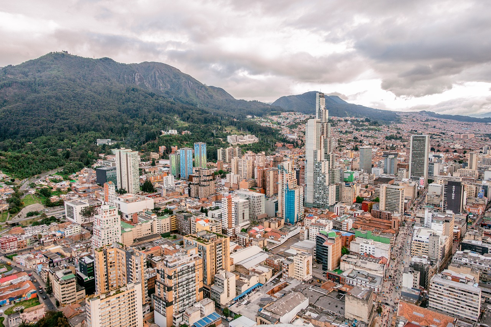

# Personal Webpage

## Marco Schürer Drews // Est. May 1992

## Profile: 

MPA Candidate @ Goldman School of Public Policy, US Berkeley. Trying to make sense of the develeopment paradox. 
I enjoy sitting on benches and watch pepole pass by, as well as, a good cup of coffee and a pice of chocolate.

## Colombia:

"La vida no la enseña nadie" - Gabriel García Márquez, El amor en los tiempos del cólera

## Music

[Listen on Spotify, Señor Loop](https://open.spotify.com/intl-es/album/2s1lH466ICjtzwgCDljKQK?si=Bo02GKNyTAufL7wfAMc2bg)

## Blog:

1. To be Continued

